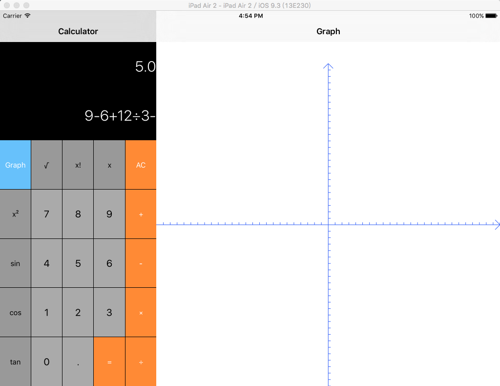
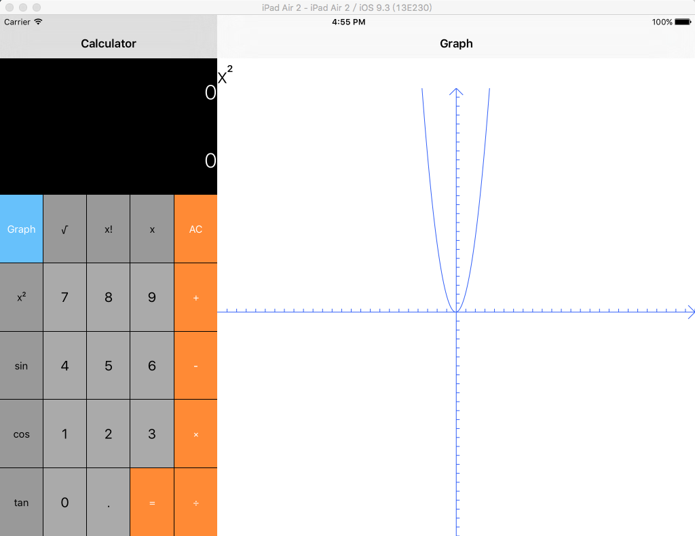

## II-GraphCalculator
SplitViewController和NavigationViewController还能这么用系列，这两个一起用就能做到iPhone和iPad兼容了。

终于知道segue的show detail是用在SplitViewController中的，在master中通过segue可以直接改变detail。

这次双MVC配合各种Controller使用更加体现了MVC的好处。

最后随手写下使用说明吧：

+ 计算器部分和正常的计算器一样，只是在计算结果下面加了一行计算过程
	
+ 图形部分点击graph再点击各种函数符号可以显示函数图像
	
+ 只能画那几个比较基础的函数图像，复杂长的函数表达式处理起来太复杂放弃...