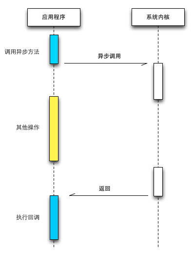

# Advanced iOS Development

## 网络

网络是几乎所有 App 的数据来源，没有网络（支付宝/微信/微博/FGO 全都不能用了

网络的 ISO 七层结构（物理层/数据链路层/网络层/传输层/会话层/表示层/应用层，每一层由大量的网络协议组成

HTTP 是应用层的一种协议也是应用最广泛的一种，所有的 www 文件都遵循这个协议

iOS 中通过网络获取数据的几种方法：

+ Data
+ NSURLConnection（Deprecated）
+ URLSession

## 多线程

提高并发度

多线程的使用场合：

+ 网络请求
+ 文件 IO
+ 各种耗时的工作...

iOS 中使用多线程的几种方法：

+ GCD
+ NSOperationQueue
+ NSThread

## 代码

> 代码是给人读的，顺便让机器执行

代码风格（Swift）：

+ 大括号换行？（！）
+ 行末分号？
+ 驼峰命名？
+ 生命变量时类型推导？
+ 什么时候用 self？
+ 缩紧？

代码规范管理：

+ xcode 自带的整理代码（option + i （只管理缩进格式
+ swiftlint

设计模式：

+ MVC（Model View Controller
+ 单例
+ 代理