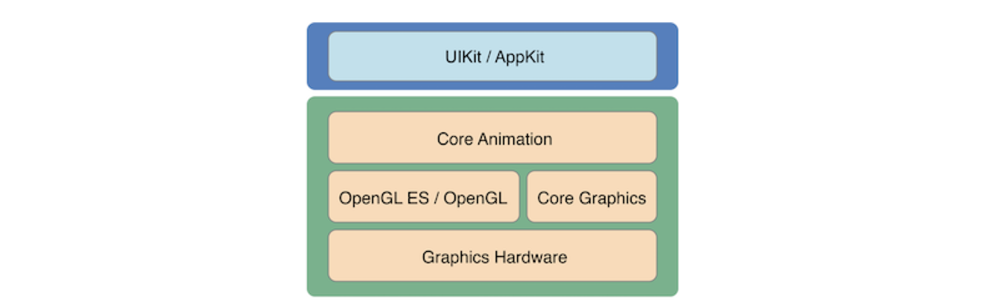
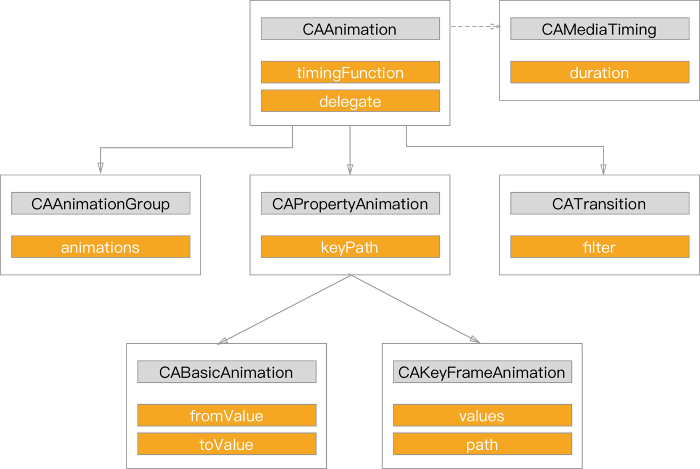
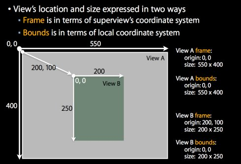

# Animation in iOS Development

*July 17, 2017*

## Introduction

iOS对动画实现的整体框架：



## 隐式动画

### CALayer

> 每一个UIView都有一个layer属性，类型是CALayer，属于QuartzCore框架。
>
> CALayer本身并不包含在UIKit中，它不能响应事件。由于CALayer在设计之初就考虑了它的动画操作功能，CALayer很多属性在修改时都能形成动画效果，这种属性称为“隐式动画属性”。 对每个UIView的非root layer对象属性进行修改时，都会形成隐式动画。之所以叫隐式是因为我们并没有指定任何动画的类型。我们仅仅改变了一个属性，然后Core Animation来决定如何并且何时去做动画。
>
> CALayer的隐式动画实际上是自动执行了CATransaction动画，执行一次隐式动画大概是0.25秒。UIView的动画底层也是使用CATranscation实现的。


## 显式动画

- UIKit
- Core Animation
- …more

### UIKit

UIKit动画实质是对Core Animation的封装，提供间接的动画接口。

可以设置如下的动画属性：

1. 大小变化(frame)
2. 拉伸变化(bounds)
3. 中心位置(center)
4. 旋转(transform)
5. 透明度(alpha)
6. 背景颜色(backgroundColor)
7. 拉伸内容(contentStretch)

UIKit中实现动画的方法

```swift
open class func animate(withDuration duration: TimeInterval, animations: @escaping () -> Swift.Void)
```

关键帧动画 & UIDynamic

### Core Aniamtion

你可以直接用Core Animation来自定义layer的动画效果。因为view和layer密切的关系，layer的变化会直接影响到view。

用Core Animation实现动画的方法，简单的说有CATransform3D和CAAnimation的子类两种。



### Core Graphics

CGAffineTransform用于绘制2D图形的仿射变换矩阵。

```swift
struct CGAffineTransform {
  CGFloat a, b, c, d;
  CGFloat tx, ty;
};

typedef struct CGAffineTransform CGAffineTransform;
```

它能简单的完成包括平移、缩放、旋转及其组合的动画效果。

## Frame & Bounds



## 还有一些动画库

[facebook/pop](https://github.com/facebook/pop)

[airbnb/Lottie](https://github.com/airbnb/lottie-ios)

